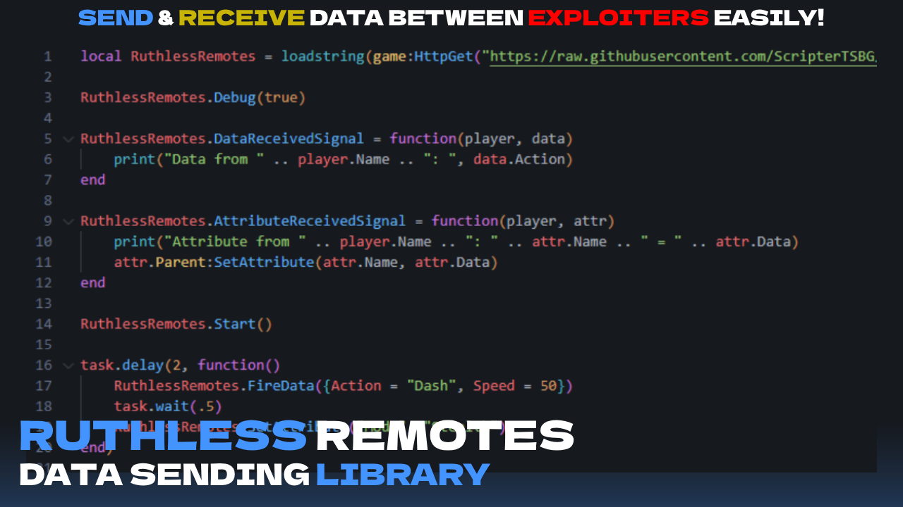

# 🌀 RuthlessRemotes

**RuthlessRemotes** is a Roblox Lua library that allows exploiters to securely transmit encoded data between clients using **animation IDs**. No remotes, no server-side — just pure stealth.



---

## ⚙️ Features

- `FireData(table)` — Encodes and sends a table of data via animation.
- `SetAttribute(name, value)` — Sends a key-value pair as a standalone attribute.
- `GetData()` — Returns a table of all received data, indexed by player name.
- `Start()` — Begins listening for incoming animation-based data.
- `DataReceivedSignal(player, data)` — Callback for full table reception.
- `AttributeReceivedSignal(player, attrTable)` — Callback for individual key/value attributes.
- `Debug(true/false)` — Enables logging for internal send/receive actions.

---

## 📦 Installation

```lua
local RuthlessRemotes = loadstring(game:HttpGet("https://raw.githubusercontent.com/ScripterTSBG/custom-libraries/refs/heads/main/RuthlessRemotes.lua"))()
```

---

## 🚀 Usage

### 🔹 Start Listening

```lua
RuthlessRemotes.Start()
```

Call this once to begin scanning for animations from other players.

---

### 🔥 Send Data

```lua
RuthlessRemotes.FireData({Action = "Jump", Speed = 30})
```

You can send any Lua table (keys and values are turned into strings internally).

---

### 📡 Receive Data

To automatically handle incoming table data:

```lua
RuthlessRemotes.DataReceivedSignal = function(player, data)
    print("Table from " .. player.Name)
    print(data.Action, data.Speed)
end
```

For single key-value pairs (attributes):

```lua
RuthlessRemotes.AttributeReceivedSignal = function(player, attr)
    print("Attribute from " .. player.Name .. ": " .. attr.Name .. " = " .. attr.Data)
    attr.Parent:SetAttribute(attr.Name, attr.Data)
end
```

---

### 📥 Get Stored Data

You can fetch all previously received tables:

```lua
local received = RuthlessRemotes.GetData()
print(received["PlayerName"]) -- Outputs the latest table received from this player
```

---

### 🧠 Debug Mode (Optional)

Enable logs to get feedback in the console:

```lua
RuthlessRemotes.Debug(true)
```

---

## 🧪 Full Example

```lua
local RuthlessRemotes = loadstring(game:HttpGet("https://raw.githubusercontent.com/ScripterTSBG/custom-libraries/refs/heads/main/RuthlessRemotes.lua"))()

RuthlessRemotes.Debug(true)

RuthlessRemotes.DataReceivedSignal = function(player, data)
    print("Data from " .. player.Name .. ": ", data.Action)
end

RuthlessRemotes.AttributeReceivedSignal = function(player, attr)
    print("Attribute from " .. player.Name .. ": " .. attr.Name .. " = " .. attr.Data)
    attr.Parent:SetAttribute(attr.Name, attr.Data)
end

RuthlessRemotes.Start()

task.wait(2)
RuthlessRemotes.FireData({Action = "Dash", Speed = 50})

task.wait(2)
RuthlessRemotes.SetAttribute("Mode", "Stealth")
```

---

## ⚠️ Limitations

- ❌ **Cannot send Roblox instances** — Only strings, numbers, and tables (with those types) are supported.
- 🧠 **All data is converted to string** before being encoded and sent.
- 💥 **Large payloads can crash the client** — Encoding long strings or large tables results in very long animation IDs, which may freeze or crash the Roblox client.
- 🔁 **No retry/reliability mechanism** — If a send fails and debug is off, no errors will show. Consider enabling `Debug(true)` for development.
- 🔒 **Only works in exploit environment** — Requires a Roblox executor. Cannot be used in regular Roblox Studio or published games.
- 📡 **Both users must be using the library** — Data transmission only works if both sender and receiver run RuthlessRemotes.
